# Examples

Every preset palette, rendered with the default dos_rebel font.

## stratos

```bash
shadowtype shadowtype -p stratos
```

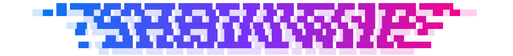

## aurora

```bash
shadowtype shadowtype -p aurora
```

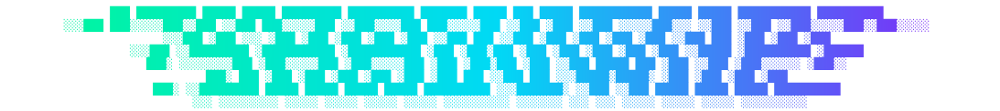

## sunset

```bash
shadowtype shadowtype -p sunset
```

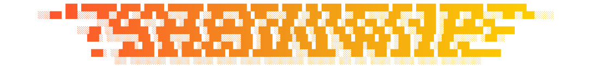

## fire

```bash
shadowtype shadowtype -p fire
```

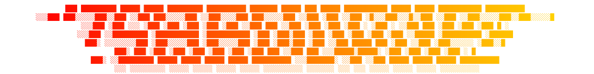

## candy

```bash
shadowtype shadowtype -p candy
```

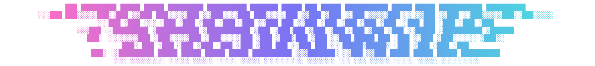

## rainbow

```bash
shadowtype shadowtype -p rainbow
```

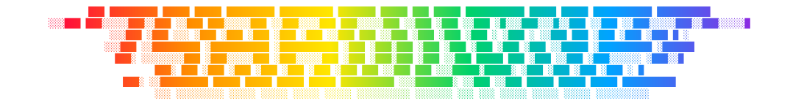

## vaporwave

```bash
shadowtype shadowtype -p vaporwave
```

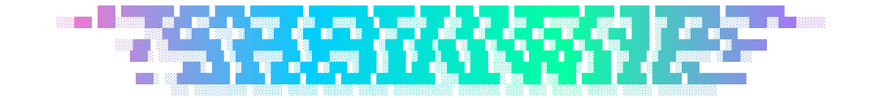

## ocean

```bash
shadowtype shadowtype -p ocean
```

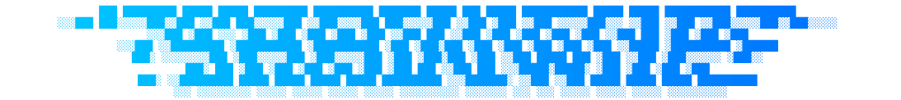

## forest

```bash
shadowtype shadowtype -p forest
```

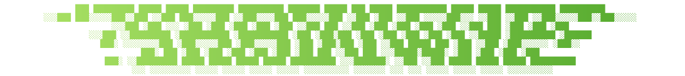

## peach

```bash
shadowtype shadowtype -p peach
```

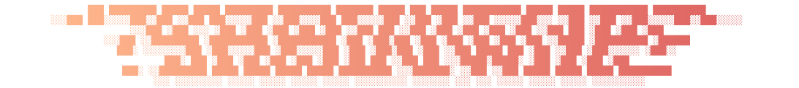

## ice

```bash
shadowtype shadowtype -p ice
```

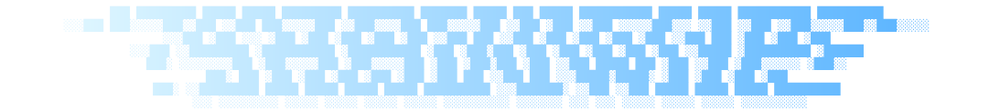

## gold

```bash
shadowtype shadowtype -p gold
```

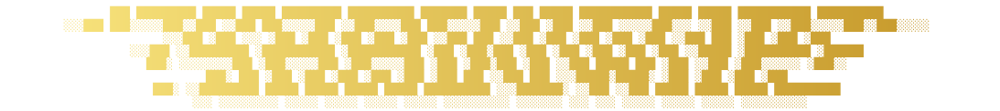

## midnight

```bash
shadowtype shadowtype -p midnight
```

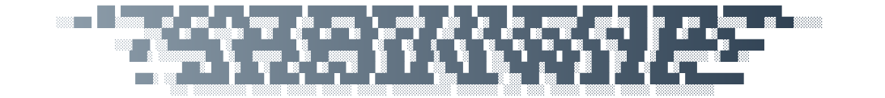

## matrix

```bash
shadowtype shadowtype -p matrix
```

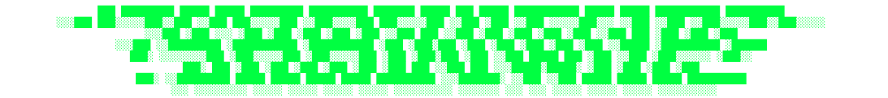

## amber

```bash
shadowtype shadowtype -p amber
```

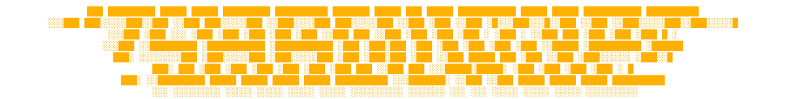

## ruby

```bash
shadowtype shadowtype -p ruby
```


## snow

```bash
shadowtype shadowtype -p snow
```

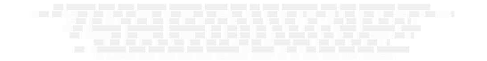

## graphite

```bash
shadowtype shadowtype -p graphite
```

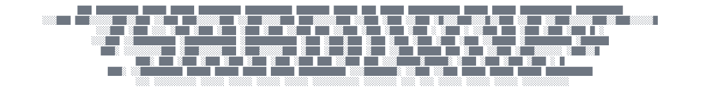

# Custom colors

## Solid color

```bash
shadowtype shadowtype -c #ff4d00
```

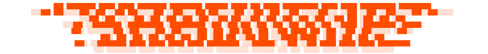


## Two-color gradient

```bash
shadowtype shadowtype -c #12c2e9 #f64f59
```


## Multi-point gradient

```bash
shadowtype shadowtype -c #12c2e9 #c471ed #f64f59 #ffd200
```

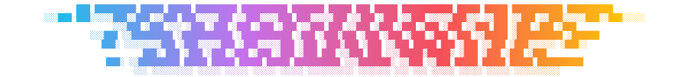


## Vertical gradient

```bash
shadowtype shadowtype -p sunset -d vertical
```


## Diagonal gradient

```bash
shadowtype shadowtype -p aurora -d diagonal
```

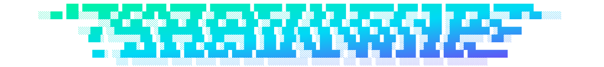
