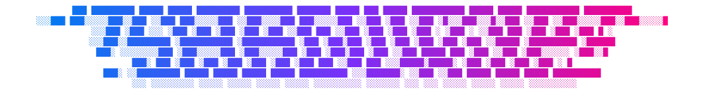

<p align="center">
  
</p>

<p align="center">
<em>shadowed ASCII banners for your terminal and your READMEs</em>
</p>

<hr/>
<br/>

<p align="center">
  <a href="https://github.com/SPTApyo/shadowtype/actions/workflows/ci.yml"></a>
  <a href="https://github.com/SPTApyo/shadowtype/releases"></a>
  <a href="https://github.com/SPTApyo/shadowtype/blob/main/LICENSE"></a>
  
  <a href="https://github.com/SPTApyo/shadowtype/commits/main"></a>
</p>

**Shadowtype** turns any text into a shadowed ASCII banner. Every run writes two files: a plain banner.txt for terminals and a banner.svg with a blue, purple and pink gradient, ready to drop at the top of a README. The banner above was made with it.

## Features

- **Two outputs at once**: plain text for CLIs, gradient SVG for GitHub pages and docs.
- **Shadow style**: the dos_rebel figlet font by default, with its signature down-left shadow.
- **Real resolution control**: redraw the text on any number of lines, from small and blocky to large and detailed.
- **Custom gradient**: as many colors as you want.
- **Scalable SVG**: set the display width, the art stays sharp.

# Getting Started

Shadowtype requires **Python 3.10+**.

## Installation

With uv:
```bash
uv tool install git+https://github.com/SPTApyo/shadowtype.git
```

With pip:
```bash
pip install git+https://github.com/SPTApyo/shadowtype.git
```

From source:
```bash
git clone https://github.com/SPTApyo/shadowtype.git
cd shadowtype
uv tool install .
```

# Usage

```bash
# banner.txt and banner.svg in the current directory
shadowtype stratos

# Write into a README assets folder
shadowtype "my project" -o .github/assets

# Custom gradient, no leading chevron
shadowtype vortex -c "#00c6ff" "#0072ff" --no-chevron

# Higher resolution: redraw the text on 16 lines
shadowtype stratos -r 16

# Wider SVG
shadowtype stratos -w 2000
```

### Options
- -o, --out DIR: output directory (default: current directory).
- -n, --name NAME: output file name without extension (default: banner).
- -c, --colors COLOR...: gradient colors, from left to right.
- -f, --font NAME: figlet font (default: dos_rebel, list them with pyfiglet -l).
- -r, --rows N: text height in lines. The text is redrawn with more or fewer characters and the figlet font is ignored.
- -w, --width PX: SVG display width in pixels, height follows.
- --no-chevron: remove the leading >.

Text is always uppercased. Below about 8 rows, the default figlet font looks better than -r.

## Development

```bash
uv run pytest
uvx ruff check .
```

# Community

For bugs, feature requests, and contributions, please use the [Issue Tracker](https://github.com/SPTApyo/shadowtype/issues).

Made with ❤️ by [SPTApyo](https://github.com/SPTApyo).

# License

This software is distributed under the **MIT License**. See [LICENSE](LICENSE) for details.

Copyright (c) 2026 SPTApyo
